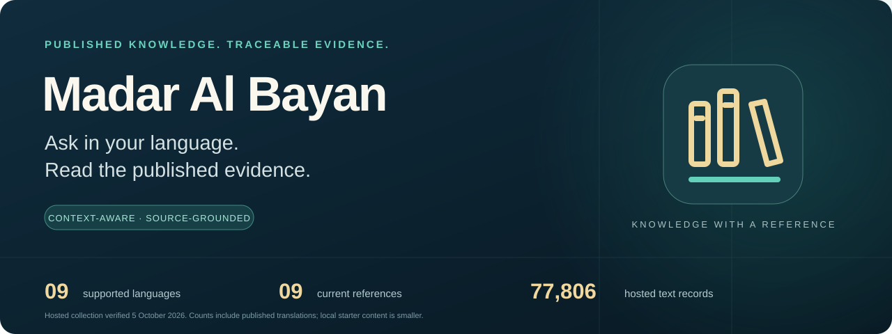
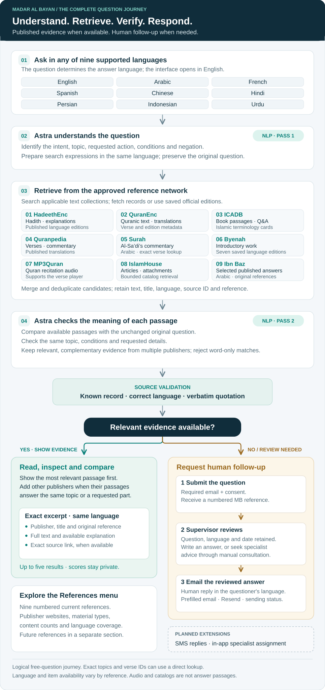

<p align="center">
  
</p>

<p align="center">
  <strong>Multilingual access to published Islamic knowledge</strong><br />
  Source-grounded discovery · Context-aware retrieval · Human review when needed
</p>

<p align="center">
  <a href="https://madar-al-bayan.asash263164.chatgpt.site"><strong>Open the live platform</strong></a> ·
  <a href="docs/REVIEWER_GUIDE.md">Reviewer guide</a> ·
  <a href="docs/GETTING_STARTED.md">Run locally</a> ·
  <a href="docs/EVALUATION.md">Test evidence</a>
</p>

<p align="center">
  <a href="https://github.com/asash3-lang/madar-al-bayan/actions/workflows/quality.yml"></a>
</p>

---

## A clear question deserves a traceable answer

Finding reliable Islamic reference material becomes harder when the questioner and the source speak different languages. Madar Al Bayan brings approved publishers into one simple search experience: ask a question, read relevant text in your language, and follow its reference.

The model helps interpret the question and select evidence. **The answer excerpts are the publisher's own text or published translation.** The primary search flow does not ask the model to write a religious answer or translate one. If suitable evidence is unavailable, the visitor can submit the question for human review.

Created by **Abdullah bin Saeed Al-Malki** · Public source release · October 2026

[Meet the creator and read the project story](docs/PROJECT_AND_AUTHOR.md).

## The deployed collection, in perspective

| 9 languages | 9 current references | 77,806 text records |
|:---|:---|:---|
| Automatic language detection for supported questions | Different providers contribute text, commentary, catalogs or audio | Includes publisher translations; not 77,806 unique works |

**Arabic · English · French · Spanish · Chinese · Hindi · Persian · Indonesian · Urdu**

The verified collection contains **20,980 hadith texts**, **56,124 Quran verse texts**, **644 published answers**, and **58 term cards**. There are also **18,393 hadith explanations**, reported separately rather than added to that total. Counts describe the hosted collection verified on **5 October 2026**; they are not a promise of universal question coverage.

> **Public code and hosted content have different scopes.** This repository contains the application and its review materials. Publisher corpora and production databases are excluded. The local bootstrap retrieves a small official starter collection, with its actual counts shown locally. See [Getting started](docs/GETTING_STARTED.md) and [Sources and rights](docs/SOURCES.md).

## What makes the experience useful

| For the visitor | What the application does |
|:---|:---|
| **Ask naturally** | Detects the supported language from the question; the language menu is not a prerequisite for search. |
| **Find the relevant passage** | Combines full-text retrieval, approved publisher adapters and model-assisted context checks. |
| **Keep the important condition** | Checks whether evidence addresses the question's scope, conditions and negation. |
| **Compare useful references** | Can show complementary passages from several publishers, ordered by relevance without displaying a misleading percentage. |
| **Inspect the source** | Preserves attribution and opens the publisher's record or exact data response when available. |
| **Ask for human review** | Collects the question and an email address; administrators can review and send a reply through the configured mail service. |

The [implemented feature inventory](docs/FEATURES.md) documents the visitor experience, evidence inspection, administration, correspondence and operational controls, with links to their implementation.

## AI at the center of the workflow

**Astra is used twice for free questions:** first to understand the request and improve the search expressions, then to assess the retrieved passages against the original question before display. Deterministic checks then enforce source identity and literal quotation.

The model helps bridge natural language and reference material while the publisher remains the source of the displayed answer. [Read the AI design](docs/AI_DESIGN.md), including the role of each tool, the safeguards, the limits and the next evaluation milestones.

## How a question becomes evidence

<p align="center">
  <a href="docs/assets/question-to-answer.svg"></a>
</p>

[Open the full-size diagram](docs/assets/question-to-answer.svg) · [Detailed request path](docs/ARCHITECTURE.md#request-path)

For free questions, **Astra performs two natural-language processing (NLP) tasks**: it interprets the request and prepares search expressions, then compares retrieved passages with the **unchanged original question**. Retrieval searches the applicable approved text collections and publisher adapters. Results can include several publishers when their passages answer the same topic or complementary parts of the request.

The application shows accepted excerpts in the question's supported language, ordered by relevance, with the publisher, title, reference and available explanation. Opening a result reveals its full source details and an exact publisher record or official data response when available. Numeric relevance scores remain private. The answer text is retrieved from published material; it is not generated or automatically translated by Astra.

The diagram shows the logical free-question journey. Initial retrieval can overlap question understanding. Exact known topics and verse references can use a direct lookup; empty retrieval goes to the no-evidence path without a passage-ranking call. The nine-reference network includes distinct text, commentary, catalog and audio capabilities, so every question does not trigger nine interchangeable answer APIs.

Explore the [architecture](docs/ARCHITECTURE.md), [API contract](docs/API.md), and [source directory](docs/SOURCES.md).

## What the References menu reveals

The **References** library icon in the right-hand menu opens a searchable, numbered directory. Each entry presents the publisher's website, material type, content scope and language coverage, with Arabic and English descriptions. **Nine current references** appear first; **25 proposed reference entries** have a separate section. An expandable language breakdown shows hadith and explanation counts for the nine enabled languages; summary cards show the hadith-text, Quran-text and language totals.

| # | Current reference | Contribution to the platform |
| ---: | :--- | :--- |
| 1 | [HadeethEnc](https://hadeethenc.com/) | 3,582 distinct hadith; 20,980 language-specific texts, with available explanations and grading |
| 2 | [QuranEnc](https://quranenc.com/) | 6,236 verses across Arabic and eight published translations: 56,124 verse-text records |
| 3 | [ICADB](https://icadb.com/) | Published book passages; 543 Arabic question-and-answer cards and 58 terminology cards in the saved collection |
| 4 | [Quranpedia](https://quranpedia.net/) | Verse-addressed translations and commentary; publisher catalog lists 142 translation editions |
| 5 | [Surah](https://surahapp.com/) | Al-Sa'di's Arabic commentary at an exact surah and verse |
| 6 | [Byenah](https://byenah.com/) | One introductory work in seven saved official language editions |
| 7 | [MP3Quran](https://mp3quran.net/) | Publisher-hosted Quran recitations; the player covers 114 surahs |
| 8 | [IslamHouse](https://islamhouse.com/) | Article catalog, attachments and available article text; search covers a bounded recent page, not the complete catalog |
| 9 | [Sheikh Ibn Baz — Official Website](https://binbaz.org.sa/) | 101 selected Arabic answers with their original references |

The [full reference table](docs/SOURCES.md#current-reference-coverage) records language availability, counts and access scope. Publisher catalog totals describe the publisher's inventory; they are not all imported searchable records. A reference's homepage helps identify the publisher; an answer's source link points to its specific record when available.

## When a question needs human review

If the search cannot find suitable published evidence, the visitor can submit the question with a **required email address and consent**. The platform stores the original question, language and arrival date, then returns a numbered reference.

The private administration inbox presents the newest enquiries first. The owner can preview a question, open its details, and **write and send the answer with the recipient already filled in**. Drafts, urgent messages, Cc/Bcc, reference-number search, Sent and reversible Trash support follow-up. The reviewer writes the response in the questioner's language; the system does not invent or automatically translate that response.

When specialist input is needed, the supervisor can coordinate a consultation outside the application, retain the request as a draft or urgent item, and send the final answer after review. Cc/Bcc can copy an outgoing reply; it does not create a separate specialist-assignment workflow. **Email delivery is implemented through Resend. SMS replies and dedicated in-app specialist assignment are planned extensions.** The separate Contact us form can collect a phone number, but it does not send an automatic phone reply.

Public statistics describe reference content and language coverage. Private administration analytics describe searches, participating languages, recurring questions and correspondence. Read the [administration guide](docs/ADMINISTRATION.md) and [email workflow](docs/EMAIL_AND_SERVICES.md).

## Expansion with a visible scope

The reference directory separates **9 current references from 25 candidate entries**. Some candidates are different collections from the same publisher; they are not 25 additional organizations. The [complete expansion directory](docs/SOURCES.md#planned-reference-directory) records each proposed collection and its next step. A separate [language shortlist](docs/LANGUAGES.md#planned-language-shortlist) identifies 11 potential additions from recorded publisher coverage. These remain future work until access, content and the complete user journey are verified.

## A two-minute review

Open the [live platform](https://madar-al-bayan.asash263164.chatgpt.site) and try these developer-authored test questions:

| Question | What to examine |
|:---|:---|
| **What is Islam?** | A published introductory hadith and its individual source link. |
| **How do I perform ablution and then pray?** | A passage covering both requested actions, rather than a generic statement about prayer. |
| **How should prayer be performed when a person cannot stand?** | Evidence explicitly addressing inability to stand. |
| **Comment augmenter la vitesse Internet pendant le Ramadan ?** | No unrelated religious excerpt simply because the question mentions Ramadan. |

The [reviewer guide](docs/REVIEWER_GUIDE.md) gives a timed route, multilingual examples and known limitations. The [demo script](docs/DEMO_SCRIPT.md) is a recording plan, not a claim that a video has already been recorded.

## Evidence, with its limits visible

| Verification | Recorded result | What it establishes |
|:---|:---|:---|
| Deployed v30 regression sample | **24 / 24 checks passed** | Sampled language, literal-quote and retrieval behavior, including nine-language cases. |
| Deployed v31 focused review | **6 requests returned HTTP 200** | Four returned relevant evidence; an off-topic question was correctly rejected; a general definition remained unanswered. |
| Publisher connection probes | Dated provider-by-provider observations | Connectivity at the time of the probe, including failures and saved-content fallbacks. |
| Public release checks | Recorded during release preparation | Reproducible code checks and packaging checks; separate from live semantic evaluation. |
| GitHub Actions | [Clean-run verification passed](https://github.com/asash3-lang/madar-al-bayan/actions/runs/37287759221) | Locked dependency installation, type checks, controlled contracts, production build and release-boundary checks on a fresh runner. |

These are engineering checks and a limited live sample, **not a measured accuracy rate for arbitrary religious questions**. Full outcomes, version labels and scope are in [Evaluation](docs/EVALUATION.md).

## Run the public source release

Prerequisites: **Node.js 22.13+**, the pinned **pnpm** version, and network access for dependency installation and optional source import.

```bash
corepack enable
pnpm install --frozen-lockfile
pnpm sources:starter
pnpm dev
```

The [setup guide](docs/GETTING_STARTED.md) documents the local URL, empty-database setup, model configuration, administrator credentials and email settings. A compatible model API account is required for free-question semantic retrieval. Direct reference paths have their own requirements and do not establish that model access is configured.

```bash
pnpm typecheck
pnpm test:contracts
pnpm build
```

Publisher access, model availability and sending-domain configuration remain external dependencies. The starter collection is deliberately small; the hosted collection is not downloaded as part of installing this repository.

## A repository built for review

| Area | Start here |
|:---|:---|
| Product and demonstration | [Feature inventory](docs/FEATURES.md) · [Reviewer guide](docs/REVIEWER_GUIDE.md) · [Demo script](docs/DEMO_SCRIPT.md) |
| Creator, purpose and product decisions | [Project and author](docs/PROJECT_AND_AUTHOR.md) |
| Administration and unanswered questions | [Administration guide](docs/ADMINISTRATION.md) · [Email workflow](docs/EMAIL_AND_SERVICES.md) |
| Installation and configuration | [Getting started](docs/GETTING_STARTED.md) |
| AI, context and future development | [AI design](docs/AI_DESIGN.md) · [Roadmap](docs/ROADMAP.md) |
| Hosting and email services | [Deployment options](docs/DEPLOYMENT.md) · [Email and services](docs/EMAIL_AND_SERVICES.md) |
| System design and routes | [Architecture](docs/ARCHITECTURE.md) · [API](docs/API.md) |
| Content and language coverage | [Sources](docs/SOURCES.md) · [Languages](docs/LANGUAGES.md) |
| Verification and release scope | [Evaluation](docs/EVALUATION.md) · [Release notes](CHANGELOG.md) · [Roadmap](docs/ROADMAP.md) |
| Contribution and safety | [Contributing](CONTRIBUTING.md) · [Security](SECURITY.md) |
| Code and content rights | [MIT license](LICENSE) · [Third-party notices](THIRD_PARTY_NOTICES.md) |

The implementation lives in `app/`, `components/`, `lib/`, and `db/`. Database migrations are versioned in `drizzle/`. Import and validation commands live in `scripts/`; review evidence lives in `docs/evidence/`.

## Current boundaries

- Coverage depends on published material in the question's language. Supported interface languages do not imply that every reference contains every answer.
- The source mix includes text, commentary, article catalogs and audio; nine references do not mean nine interchangeable answer APIs.
- Byenah currently relies on seven saved official language editions in the hosted service. Dorar is outside the current-reference count because its live requests were rejected at the recorded check.
- Model decisions can be wrong, publisher availability can change, and some searches remain unanswered. The platform exposes the evidence and supports human review.
- Email delivery requires working provider credentials and a verified sender. Do not enter personal beneficiary data in demonstration fixtures or public issues.

## Meet the creator

**Lieutenant Colonel Abdullah bin Saeed Al-Malki** is the creator, owner and sole participant behind Madar Al Bayan. He holds a **master's degree in Computer Networks from King Fahd University of Petroleum & Minerals (KFUPM)** and serves as **Director of the Communications and Information Technology Division, Eastern Region Police**.

His work on this personal project brings network engineering and technology leadership to a clear purpose: making published Islamic knowledge easier to discover, understand and verify across languages. Read the [creator's profile and project story](docs/PROJECT_AND_AUTHOR.md).

Original application code is distributed under the [MIT license](LICENSE). Publisher texts, translations, trademarks and dependency packages retain their respective rights. Referencing a publisher does not imply its endorsement of this project.

<p align="center"><sub>Madar Al Bayan · Knowledge with a reference you can inspect.</sub></p>
