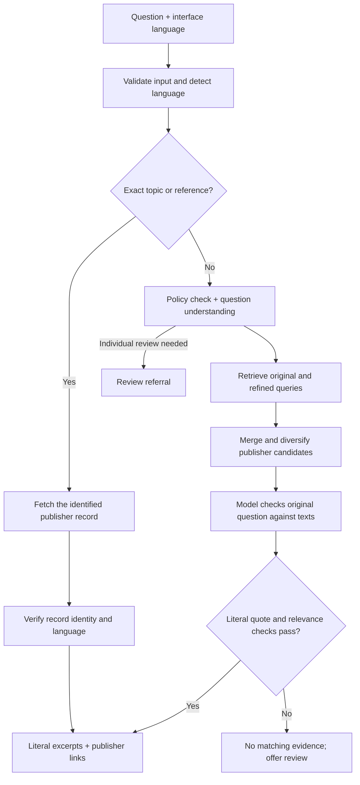
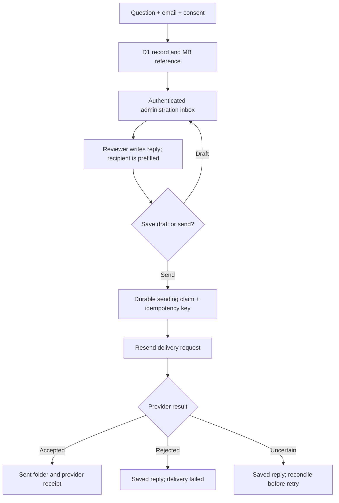

# Architecture

**An evidence retrieval system for multilingual Islamic reference questions.** AI helps interpret the request and assess retrieved passages. The public search flow returns the publisher's words, not an AI-written religious answer.

This document describes the deployed v31 implementation reviewed on **5 October 2026**. The public repository is a source-code release: it does not include production credentials, beneficiary records, or the hosted publisher corpus. Reproducing the full hosted experience requires authorized source data, runtime bindings, and model access.

## Request path

### 1. Language and intent

`app/api/ask/route.ts` accepts a question of 1–1,000 characters and a supported language hint. `lib/detect-language.ts` combines script checks, language-specific clues, and statistical detection. A supported detected language overrides the interface selection. Short or ambiguous input may retain the selection; a verse reference such as `1:1` needs that hint.

The supported languages are English, Arabic, French, Spanish, Chinese, Hindi, Persian, Indonesian, and Urdu. Language support does not mean that every publisher or every question is available in all nine languages.

`lib/federated-search.ts` first attempts bounded introductory topics, exact source titles, and explicit verse or tafsir references. These direct lookups are deterministic paths. Their success does **not** demonstrate model-based understanding.

For a free question, `lib/query-understanding.ts` requests a structured plan containing:

- The actual intent, preserving conditions and negation.
- One to three search expressions in the question's language.
- Whether individual review is needed.

The planner never writes the answer. Initial retrieval overlaps with planning; refined retrieval follows the plan. The unchanged original question remains the final acceptance criterion.

### 2. Candidate retrieval

`lib/fulltext-search.ts` performs BM25-style scoring over publisher text and explanations. `lib/retrieval-terms.ts` supplies normalization and bounded lexical expansion, including Arabic normalization and Chinese character pairs. This is **lexical retrieval followed by model assessment**, not a vector database or embedding index.

The full-text stage reserves strong candidates from each indexed publisher before filling remaining slots. A title index and bounded teaching-topic routing improve recall. `lib/publisher-adapters.ts` adds applicable publisher results, including original book passages, exact Quran references, tafsir, and available article text.

Candidates are deduplicated and interleaved by publisher before the final limit of 16. Multiple publishers can contribute, but the system does not impose a publisher quota on the displayed answer. A single relevant publisher is preferable to adding an unrelated passage for variety.

Catalog entries, attachment descriptions, and audio recordings are separate capabilities. They are not automatically treated as answer text.

### 3. Contextual acceptance

`lib/context-ranking.ts` assesses the retrieved texts through the OpenAI Responses API. The configured default is `gpt-6-astra`; deploying it requires an account with access. `OPENAI_MODEL` can override the model, but changing it requires new evaluation. The planner uses low reasoning effort and the final judge uses high effort for recognized reasoning models.

The final judge receives the original question and bounded, contiguous source text windows. Its structured output is checked in code:

| Check | Required behavior |
|---|---|
| Record identity | Every returned ID must belong to the retrieved candidate set. |
| Literal wording | The quotation must occur contiguously in the selected original text or explanation. |
| Intent | The passage must answer the request or a substantive requested part. |
| Conditions | Relevant qualifiers, negation, and scope must be respected. |
| Quran | An accepted passage must be the entire provided verse, not a fragment. |
| Ranking | Ordinary passages require an internal score of at least 85; Quran passages require 95. |
| Output | At most five accepted passages, ordered by relevance. |

These scores are internal ordinal relevance bands, **not confidence percentages or probabilities of religious correctness**. The public API strips the numeric score.

Complementary passages may answer different parts of a compound question. A procedural question needs procedure; a text about virtues alone is insufficient. A question about someone unable to stand must not receive an unconditional instruction to stand.

Both model stages treat questions and documents as untrusted data. The model is instructed not to translate answers, issue rulings, invent references, or use external knowledge. Literal validation reduces fabricated quotation risk; it does not establish that every selection is substantively correct.

### 4. Results and provenance

Each evidence item retains publisher identity, source ID, language, original body, explanation where present, retrieval time, version where supplied, and access mode (`live` or `snapshot`). `lib/source-links.ts` accepts only approved HTTPS publisher hosts and uses a record-specific page or official data response. It does not replace a missing deep link with a publisher homepage.

The public search response sets `generationEnabled: false`, `generationStatus: "disabled"`, and `answer: []`. The displayed content comes from `evidence`. Publisher-provided translations are retrieved as published; the application does not machine-translate an answer into a missing language.

## Failure behavior

| Failure or limitation | Result |
|---|---|
| Live Hadith fetch fails | Try the corresponding official saved edition, if provisioned. |
| One publisher fails | Retain usable results from other completed providers. |
| Planner is unavailable | Use the original query; final contextual acceptance still applies. |
| Final model fails or returns invalid output | Do not display unvalidated free-query candidates. |
| No matching published translation | Do not substitute an automatically translated answer. |
| Personal adjudication or insufficient evidence | Offer referral with explicit email consent. |
| Analytics write fails | Preserve the search response. |

Free-query model work can take tens of seconds. The planner has a 20-second deadline; the default final judge has a 60-second deadline. Source adapters have separate limits, and the browser client uses a bounded 120-second overall retry budget. These are limits, not a latency guarantee. Small in-memory caches expire and are not a durable source of truth.

## Human review and correspondence

`lib/referrals.ts` stores the question, detected language, recipient email, timestamps, and numbered reference. `components/admin-workspace.tsx` exposes Inbox, Sent, Urgent, Trash, search, a preview, and reply details. Replies support drafts and optional Cc/Bcc. Phone-only contact messages remain contact requests; email delivery requires an email address.

Updates use an `updatedAt` concurrency token. A durable database claim and revision-based idempotency key reduce duplicate sends. A provider acceptance receipt records `sent`; it does not prove inbox placement or reading. An uncertain delivery is retained for reconciliation rather than blindly resent. Deletion moves a message to Trash and can be reversed.

The administrator session uses a secure HTTP-only cookie and a server-side hashed token. All admin message and analytics routes require authentication. Reviewer replies are human-authored; the interface does not certify the reviewer's qualifications.

## Analytics and data boundaries

`lib/search-analytics.ts` records query text, normalized query, language, outcome, and timestamp. It masks recognizable emails, links, and long numeric sequences before storage. That is limited redaction, not a guarantee of anonymization. Referral and contact records contain the information deliberately submitted for follow-up.

Administration analytics summarize search volume, outcomes, language participation, repeated questions, messages, and replies. Counts represent interactions, not unique people. Date boundaries use Riyadh time. No visitor-level analytics or private correspondence is included in this public repository.

## Code map

| Concern | Main entry points |
|---|---|
| Search page and language behavior | `app/page.tsx`, `lib/detect-language.ts`, `lib/i18n.ts` |
| Search orchestration | `lib/federated-search.ts` |
| Question planning and final acceptance | `lib/query-understanding.ts`, `lib/context-ranking.ts` |
| Local text retrieval and publisher access | `lib/fulltext-search.ts`, `lib/source-search.ts`, `lib/quran-search.ts`, `lib/publisher-adapters.ts` |
| Publisher identity and links | `lib/types.ts`, `lib/source-links.ts` |
| Corpus metadata and references | `lib/library-statistics.json`, `lib/reference-directory.ts` |
| Review correspondence | `lib/referrals.ts`, `lib/message-store.ts`, `lib/reply-email.ts` |
| Authentication and persistence | `lib/admin-auth.ts`, `db/`, `drizzle/` |
| Request contract | [API reference](API.md) |

The runtime uses React, TypeScript, Next-style App Router routes through Vinext, Cloudflare Workers, and D1. Legacy case-review routes remain separate from the public question-to-email workflow; they require the hosting identity integration and are not needed for the public reviewer tour.
