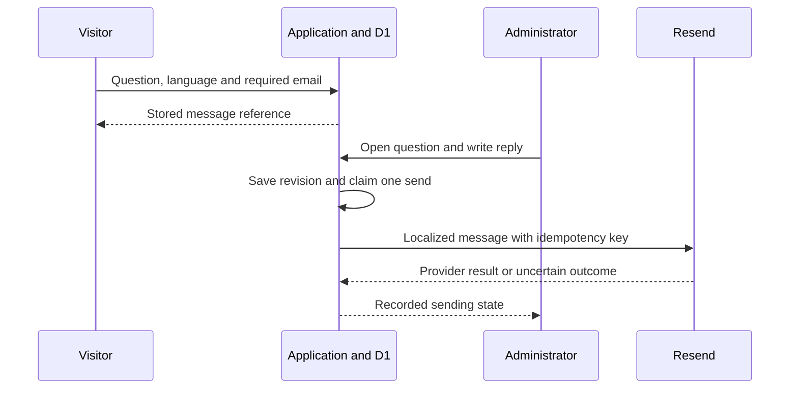

# Email and supporting services

Madar Al Bayan combines a published-reference search service with a human follow-up channel. A model does not silently write and send an answer to a visitor's mailbox. An authenticated administrator writes the reply; the application addresses and delivers it using the question's stored contact information.

## Services used

| Service or component | Actual responsibility | Configuration boundary |
|:---|:---|:---|
| Sites hosting | Hosts the reference demonstration and its deployment environment | Current live Site; its production project identity is omitted from this public package |
| Cloudflare Workers | Executes server routes, publisher requests and model/mail calls | Worker runtime, HTTPS routes and secret bindings |
| Cloudflare D1 | Stores questions, message references, reply states and administrator sessions | Private `DB` binding; production records never belong in GitHub |
| OpenAI Responses API / Astra | Question interpretation and retrieved-evidence assessment | `OPENAI_API_KEY` and an available `OPENAI_MODEL` |
| Resend | Sends transactional reply emails | `RESEND_API_KEY` and a verified `MAIL_FROM` sender |
| Project email templates | Creates localized HTML and plain-text reply bodies with message number, question, answer and references | [`reply-email.ts`](../lib/reply-email.ts); this is application code, not AI translation |
| Approved publisher APIs and saved editions | Supply religious source content and published translations | See [Sources](SOURCES.md) |
| GitHub and its quality workflow | Source review, version history and controlled code checks | Does not host the application's database or send the visitor's email |

## From enquiry to reply

The recipient's address is already stored with the question. The administrator can supply validated CC/BCC copies where needed without re-entering the primary recipient. The reply template uses the question language and appropriate text direction. The body of the answer is administrator-authored; the system does not claim to translate that answer automatically.

The implemented delivery channel is **email**. A phone number submitted through the separate contact form is a contact detail, not an enabled SMS destination. SMS replies and a dedicated specialist-assignment workflow are [planned improvements](ROADMAP.md#human-follow-up-extensions). Specialist consultation can be coordinated manually before the supervisor sends the final email; Cc/Bcc sends a copy of that outgoing reply and does not route a private unanswered case to a specialist.

## Sending behavior implemented in this release

[`referrals.ts`](../lib/referrals.ts) saves the answer revision before sending. A durable database claim prevents competing requests from sending the same approved revision concurrently. The request goes to `https://api.resend.com/emails` with an idempotency key derived from the question ID and reply revision.

The application records `pending`, `approved`, `sending`, `sent`, `delivery_failed` or `delivery_unknown` as appropriate. An uncertain timeout is not blindly retried. A provider message ID is stored when Resend accepts the message. **Acceptance by the sending API is not proof that the recipient opened the message or that the mailbox placed it in the inbox.** Delivery/bounce webhook reconciliation is a future operational improvement; it is not claimed as implemented here.

## Configure a new sender

Create a Resend account, add a domain you control, and complete the DNS verification requested in its dashboard. Use the exact records supplied for your domain rather than copying records from another project. Configure a permitted sender address as `MAIL_FROM` and put the API key in server-side secrets. The provider's domain-verification instructions explain its SPF/DKIM requirements.

For an independent deployment:

1. Configure the private D1 database and administrator credentials.
2. Set `RESEND_API_KEY` and `MAIL_FROM` in the deployment secret manager.
3. Submit a synthetic enquiry using a mailbox you control.
4. Reply from the administrator inbox and confirm receipt in that mailbox.
5. Inspect the stored provider outcome and mail-provider logs if sending fails.

No domain, mail account, password or delivery entitlement is supplied by downloading this repository. Sender verification and actual receipt are separate checks from a successful code build.

## Why these services remain separate

Publisher APIs provide knowledge. Astra assesses intent and context. D1 preserves the workflow. Resend delivers the administrator's response. This separation makes a failed external service easier to diagnose and keeps a sending failure from becoming a claim that an answer was delivered.

Changing the website host does not necessarily require changing Resend or the model provider; it requires carrying the server-side configuration and adapting the application runtime/database interfaces correctly. See [Deployment](DEPLOYMENT.md).

## Official references

- [Resend Send Email API](https://resend.com/docs/api-reference/emails/send-email)
- [Resend domain verification](https://resend.com/docs/dashboard/domains/introduction)
- [Resend idempotency keys](https://resend.com/docs/dashboard/emails/idempotency-keys)
- [Cloudflare D1 bindings](https://developers.cloudflare.com/d1/get-started/)
- [Cloudflare Worker secrets](https://developers.cloudflare.com/workers/configuration/secrets/)
